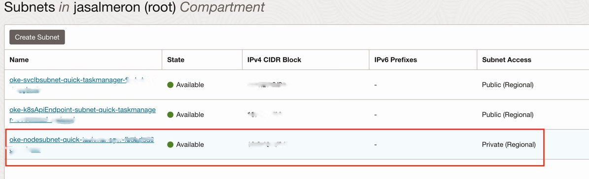

# Java Platform Group interview challenge - TaskManager

## 1. How to start the TaskManager application in your local environment

> Warning! during this section, both for tests and running the docker containeraized application, runs MySQL on port 3306 and starts the application in 8080 so be sure those ports are available, or it will fail.

### You have to install before running in your local environment with Docker:

- Apache maven (recommended>= 3.6.3) or alternatively you can run Maven using the included [Maven wrapper](https://maven.apache.org/wrapper/) 
- Java 17 JDK
- [Docker](https://docs.docker.com/engine/install/) 
- Git client (optional)

> Note: Checkout [SDKMAN](https://sdkman.io/) if you are using other Java/Maven version and you want to easily switch between different Java/Maven versions.

### After having previous dependencies installed:

1. Clone this repository or download this repo as a ZIP and uncompress it.
2. Change directory in the terminal to the `task-manager` folder.
3. Run the command below in the terminal to build and pass the tests of the application. This will generate at `target/jgiven-reports/index.html` an HTML report of the acceptance tests.
```
$ mvn clean install
```
or with Maven wrapper (recommended):
```
$ ./mvnw clean install
``` 
4. Start application 
   1. Executing the command below in the terminal:
   ```
   $ docker compose up --build -d
   ```
   2. Alternatively, you can execute the command below in the terminal, but you have to provide a running mysql instance that follows config.yml 'database' section (an easy way to do that is by executing the command in the terminal: `docker-compose up -d db`) 
   ```
   $ java -jar target/task-manager-1.0-SNAPSHOT.jar db migrate src/main/resources/config.yml && java -jar target/task-manager-1.0-SNAPSHOT.jar server src/main/resources/config.yml` 
   ```
   
## 2. Run tests and generate report

On top of the generated tests during the build which includes the already commented HTML report of acceptance test using JGiven, once the application is running and with an empty table `task` in the database it can be performed a suite of tests that generates an HTML report.

For that, firstly is required to have installed `node.js` and `npm`. If not, here you have a [handy guide] (https://docs.npmjs.com/downloading-and-installing-node-js-and-npm)

Then, install newman, which is a tool to execute tests and generate reports for Postman collections, and its plugin for generate HTML reports:
```
npm install -g newman
npm install -g newman-reporter-htmlextra 
```
Once installed run from the postman\ directory within the project:
```
newman run -d dataset_task.json Task\ Manager\ Automated\ Tests.postman_collection.json --verbose -r htmlextra
```
This will generate an HTML report in postman\newman folder. An example is provided [here](postman/newman/Task%20Manager%20Automated%20Tests-2023-07-19-20-27-41-837-0.html)  

> Note: This postman newman tests are meant to pass all them as long as the database doesn't have tasks already created. 

## 3. Deploy taskmanager app to Oracle Cloud Platform (OCP)

### 3.1 Preparing the environment
To follow next steps you will need (any step can be skipped if it is already installed or configured):
- An Oracle Cloud Platform account (OCP), if you don't have one, sign in [here](https://www.oracle.com/es/cloud/sign-in.html).
- [OCI Tenancy](https://docs.oracle.com/en-us/iaas/Content/GSG/Tasks/contactingsupport_topic-Finding_Your_Tenancy_OCID_Oracle_Cloud_Identifier.htm). Note your region, you will use it throughout the tutorial.
- The [Terraform CLI](https://developer.hashicorp.com/terraform/tutorials/oci-get-started/install-cli) installed.
- The [OCI CLI](https://docs.oracle.com/en-us/iaas/Content/API/SDKDocs/cliinstall.htm) installed.

Configure the OCI CLI from your terminal:
```
$ oci session authenticate
Enter a region by index or name(e.g.
1: af-johannesburg-1, 2: ap-chiyoda-1, 3: ap-chuncheon-1, 4: ap-dcc-canberra-1, 5: ap-hyderabad-1,
...
```

After selecting a region if you were not logged into OCP you'll be redirected to OCP Login. Afterwards provide a name of your profile, e.g taskmanager:
```
Enter the name of the profile you would like to create: taskmanager
Config written to: /Users/Config written to: /Users/<your-home-directory>/.oci/config/.oci/config
Try out your newly created session credentials with the following example command:
 oci iam region list --config-file /Users/<your-home-directory>/.oci/config --profile taskmanager --auth security_token
 ```
The token has a 1-hour Time To Live (TTL). If it expires, refresh it by providing the profile name.
```
$ oci session refresh --profile taskmanager
```

### 3.2 Push the taskmanager image to the Oracle Container Registry
Now we will create an Oracle Container Registry to push our created image in section 1.4 of this README.

Configure an Auth token:
https://docs.oracle.com/en-us/iaas/Content/Registry/Tasks/registrygettingauthtoken.htm#Getting_an_Auth_Token

Create the container repository:
```
$ oci artifacts container repository create --display-name oracle-challenge/taskmanager --compartment-id <compartment_ocid>
```
Execute a Docker login to the repository and enter your previous generated Auth token (where ocp-account-username is your Oracle Cloud username):
```
docker login <region-id>.ocir.io/<ocp-account-username>
password: <auth-token>
```

List your local docker images and copy the image id of oracle-challenge/task-manager (or alternatevily the image name `oracle-challenge/task-manager:latest`)
```
$ docker images
```

Create a docker tag. Note that if your tenancy is old, instead of the tenancy namespace (Object storage namespace) found in the Tenancy details page you'll have to use your tenancy name.
```
docker tag <image-id-or-image-name> <region-key>.ocir.io/<tenancy-namespace>/oracle-challenge/task-manager:latest
docker push <region-key>.ocir.io/<tenancy-namespace>/oracle-challenge/task-manager:latest
```
Convert the new oracle-challenge/taskmananger repository to public using the Oracle Console:
- Access to Container Registry

- Select the container registry just created (oracle-challenge/taskmanager) and click on "Change to public":


### 3.3 Create OKE Cluster
Now that our docker image is uploaded we'll prepare an OKE cluster where the application will be deployed. We'll do it through the OCP web console:

- Sign into your OCI account, click on the 'hamburguer' menu ico in the upper left corner of the page and go to "Developer Services" > "Kubernetes Clusters (OKE)" (or alternatively search 'OKE' in the search box):  

- Click on "Create cluster" button, select "Quick start" option and "Submit":  

- Enter a name for the cluster e.g. taskmanager, reduce the amount of memory to 4 GB and continue to the next step and click on "Create cluster".  


- In the "Kubernetes Clusters (OKE)" click on the "taskmanager" created cluster and the click on the VCN name link:  

- Copy or remember the name of the OKE cluster VCN and the private subnet because they will be used in the next section (or you can visit again this page if you forget it).  


### 3.4 Create MySQL database
- After having our OKE cluster created, click on the 'hamburguer' menu ico in the upper left corner of the page and go to "Databases" > "DB Systems" (or alternatively search 'DB Systems' in the search box)  
  
- Click create database and fill the field "Name" with a name for the database, e.g. taskmanager_mysql. Select "Standalone option" and fill the "Create administrator credentials" section witha username and a password. Remember them or save them in a secure place, you'll need them later.  
In the "Configure networking section" select the Virtual cloud network (VCN) that was created for the OKE cluster and select the private subnet that was created within that VCN.  
  
  
- Leave the rest of the options as they are and click on create button.
- Once is created in DB Systems page you should see the name of the database introduced in the previous step, click on it and copy the "Private IP address" value:
[created mysql private ip address value](screenshots/created_mysql_private_ip_address.jpeg)

### 3.5 Configure secrets in Vault
Before jumping into the deployment of our task manager application to the OKE cluster we need to provide 3 secrets with Vault:
   - Database username
   - Database password
   - Database JDBC connection URL
     
#### Step 1: Create and Configure the OCI Vault:
- Log in to your Oracle Cloud Infrastructure Console.
- Go to "Vaults" under "Security" in the main menu.
- Click on "Create Vault" and provide the necessary details such as compartment, name, and description for the Vault.
Once the Vault is created, click on its name to access its details.
- Click on "Create Key" in the "Master Encryption Keys" section. Provide the name and create it with the default parameters.
- Inside the Vault, click on "Create Secret" to add the secrets needed by task manager application:
  - DB_USER provided with the database user plain text value of the database username created in 3.4 Section.
  - DB_PASS provided with the database password plain text value of the database password created in 3.4 Section.
  - DB_URL provided with the database JDBC url plain text value of `jdbc:mysql://<database-ip>:3306/taskmanager?createDatabaseIfNotExist=true` replacing `<database-ip>` by the "Private IP address" of the database in 3.4 Section.
#### Setp 2: Provide secrets references in Kubernetes deployment file
  - Replace the base64 encoded values provided in Vault for each secret for the placeholders for each one in `deployments.yaml`:  


### 3.6 Deploy taskmanager application to OKE cluster
Now we have to configure the access to the OKE cluster. We'll do it using kubectl installed locally. For that, first follow the section "Accessing a Cluster Using kubectl Installed Locally" of this link https://docs.oracle.com/en-us/iaas/Content/ContEng/Tasks/contengaccessingclusterkubectl.htm  and https://docs.oracle.com/en-us/iaas/Content/ContEng/Tasks/contengdownloadkubeconfigfile.htm#localdownload. In the end, after following those guides you should have:  
- [kbctl installed](https://kubernetes.io/docs/tasks/tools/)
- Genereted an API key pair configured in the Console and installed in your local environment (https://docs.oracle.com/en-us/iaas/Content/API/Concepts/apisigningkey.htm) 
- OCI CLI (previously installed as per section 3.1 requirements)
- Created a .kube config folder in your user's home (`mkdir $HOME/.kube`)
- Having created an access to your previously created OKE cluster. You have to have configured with a command like this (don't forget when you reach the step 4.7 of "Setting Up Access to Clusters" to use the OCID of the previous created OKE cluster, in the guide explains where to obtain it):  
```
$ oci ce cluster create-kubeconfig --cluster-id <ocid-taskmanager-oke-cluster> --file $HOME/.kube/config --region <region-id> --token-version 2.0.0  --kube-endpoint PUBLIC_ENDPOINT
```
To set your KUBECONFIG environment variable to the file for this cluster, use:
```
$ export KUBECONFIG=$HOME/.kube/config
```
Now, it's time to deploy our task manager app to the cluster. From the root of the cloned challenge repository:
```
$ kubectl apply -f deployment.yaml
$ kubectl apply -f services.yaml
```
After a couple of seconds, eventually the application would be reachable. To get the public IP to access it run:
````
$ kubectl get services

NAME                   TYPE           CLUSTER-IP     EXTERNAL-IP     PORT(S)             AGE
kubernetes             ClusterIP      <private-ip1>      <none>       443/TCP,12250/TCP   10h
task-manager-service   LoadBalancer   <private-ip2>   <external-ip>   80:32475/TCP        27s
````
Pick the IP value of <external-ip> and you can run a simple curl to check that the task manager application is reachable and working as expected:
```
$ curl -XGET "http://<external-ip>/tasks" -v
```

## Possible improvements & tradeoffs 
- Use of Terraform to create the infrastructure in OCP and deployment of the app. E.g. this repository could be used as an starting point for creating the cluster: https://github.com/oracle-terraform-modules/terraform-oci-oke/. On top of that would be nice also to orchestrate also the creation of the Oracle MySQL database on top of it.
- Use of Github Actions to create the cluster if doesn't exists and build, test, generate a docker image and deploy it for each new version of the application, by implementing a CI/CD pipeline.
- For the steps I described to create an OKE cluster and a MySQL by using the Oracle Console I skipped the possibility of creating a Stack and later plan and apply them with Terraform. Could be interesting to do it to have a Terraform configuration file in case it is needed to have a base to automatize with scripts this infrastructure.
- The database user used for connecting from the application app to the database would be better changed to a user with restricted privileges, now is the admin user.
- Swagger description of the API can be added for documentation purposes.
- Improve newman POSTMAN tests so that some of them don't depend on the database task table being empty.
- I didn't reach to have time to develop a proper collection of application logs, application metrics and JVM metrics in order to search, visualize them and set alarms based on them in the deployed solution in OCP. For a production-ready application this should be highly desirable or even mandatory.
- There isn't any scalability policy which should be very desirable for a production-ready application.
- It should be used secure socket layer (SSL) certificates with the OKE cluster created load balancer.
- I considered out of the scope for this challenge to provide some sort of authentication/authorization mechanism for the REST API.
- I considered out of the scope for this challenge to associate tasks to a given user.
- I considered out of the scope for this challenge to provide a pagination mechanism for the GET /tasks call.
- I considered out of the scope for this challenge to improve the task database maybe by indexing the date field or adding a field for controlling when the task rows are created/modified.